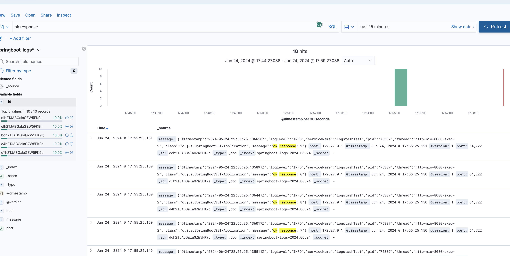
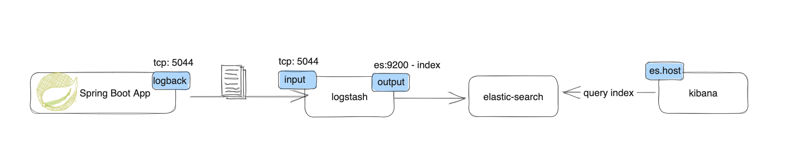
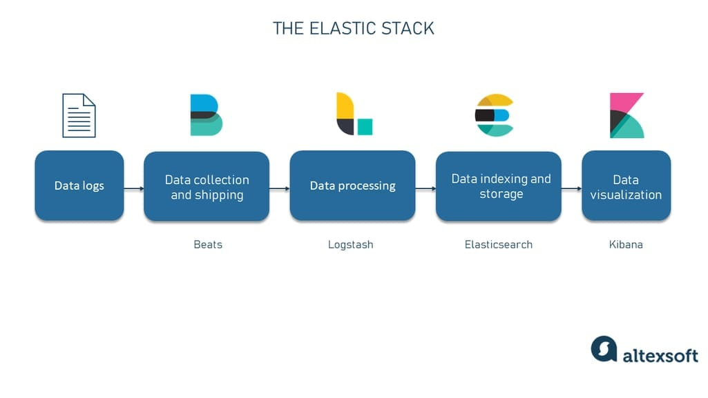
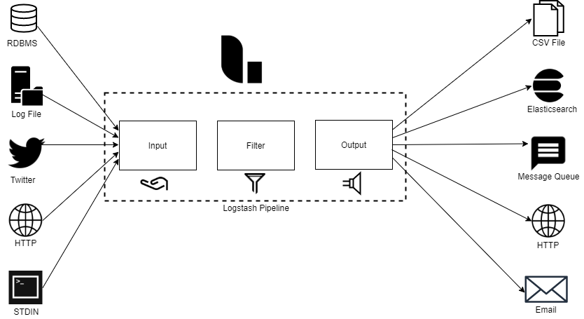
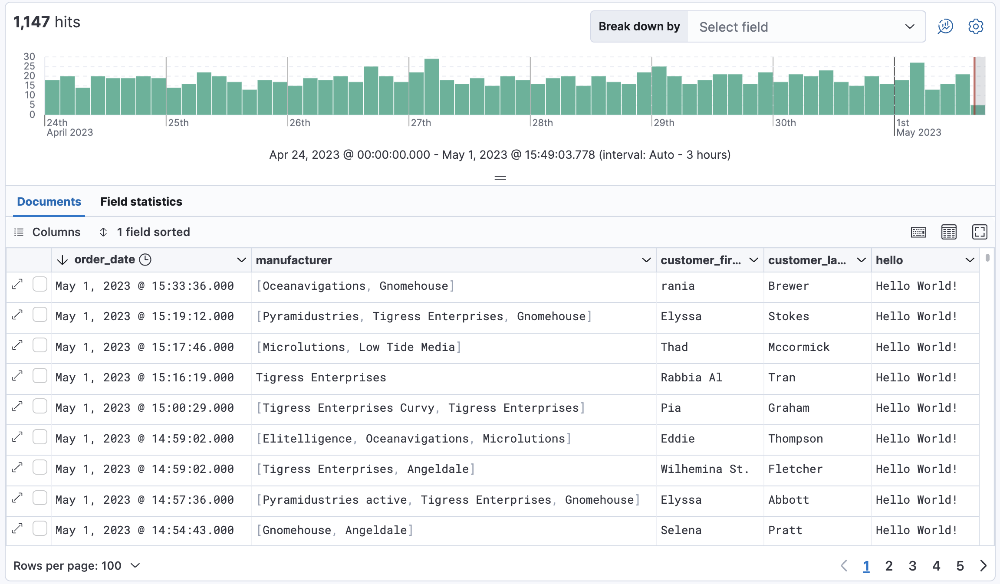
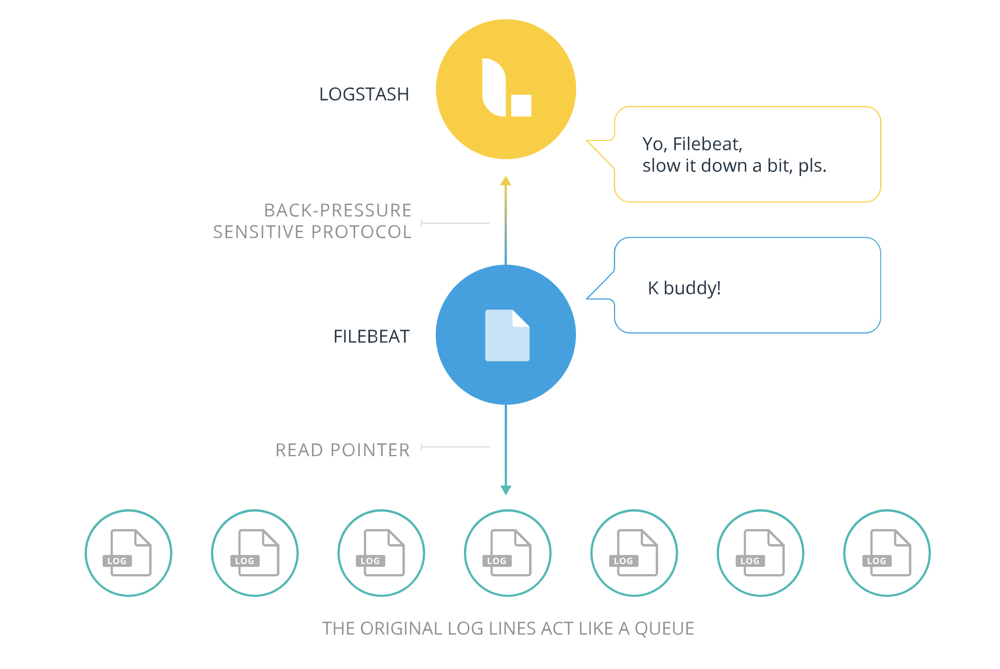
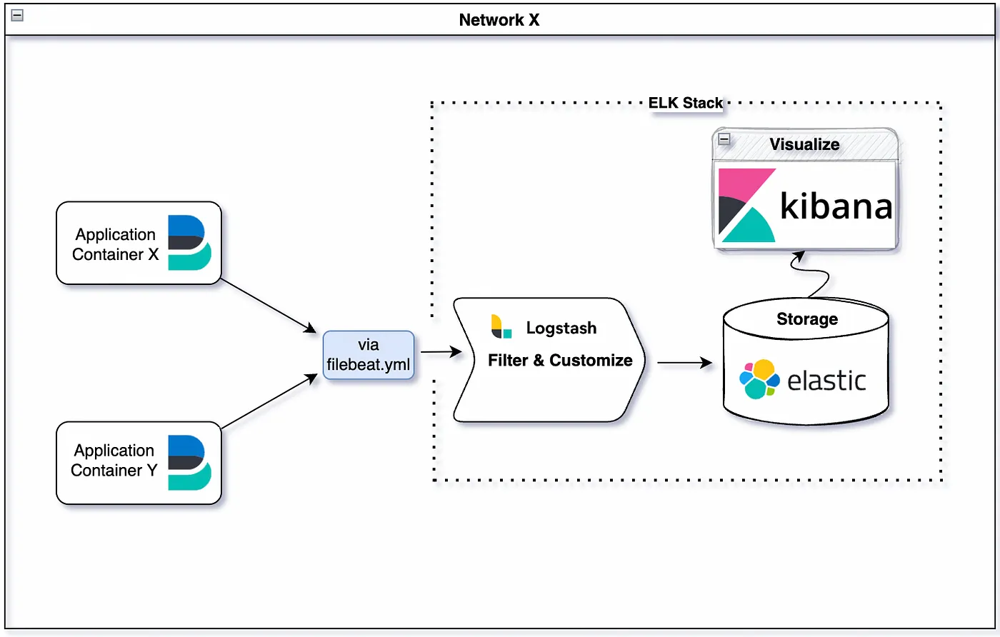
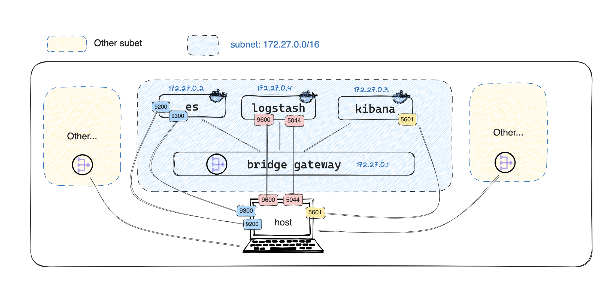

# Spring Boot 3 - ELK (Docker Integration)

This is a demo project of Spring Boot 3 with ELK (Docker)


## Quick Start

Run ELK in docker
```shell
docker-compose up
```

Clone the project and deploy
```shell
mvn clean install
```

Run application and hit with following cURL
```shell
curl --location 'http://localhost:8080/ok/10'
```

Then, you should be able to see the logs in the `http://localhot:5601` by adding index pattern `springboot-logs*`. 

`Stack Management -> Index Management -> Create Index -> Discover`



## Workflow


1. Spring Boot application sends log via logback through TCP to logstash.
2. Logstash accepts logs by exposing tcp 5044 in advanced.
3. Logstash process logs with filter and send to specified elasticsearch host with index
4. Elasticsearch stores the logs with the index
5. Kibana queries elasticsearch api to visualize the log.


Alternatively, we can use `beats` to read the log file that springboot application persist in the file system, then beats send to logstash


## Introduction to ELK

###  Logstash


Logstash is an open-source data processing pipeline that ingests data from multiple sources, transforms it, and then sends it to a destination, typically a data store or an analytics platform. It is part of the Elastic Stack, along with Elasticsearch for storage and search, and Kibana for data visualization and management.

Logstash is typically used as the “processing” engine for any log management solution (or systems that deal with changing data streams).

Logstash can collect logs and events from various sources, such as log files, databases, and message queues. It then processes the data using filters to parse, enrich, and transform it as needed. Finally, the processed data is sent to a destination, which could be Elasticsearch for indexing and storage, or other destinations like a file, a database, or a message broker.


### Elasticsearch

Elasticsearch is a distributed, RESTful search and analytics engine designed for horizontal scalability, reliability, and real-time search and analysis of large volumes of data. It is part of the Elastic Stack (formerly ELK Stack), which also includes Logstash for data collection, transformation, and enrichment, and Kibana for data visualization and exploration.

Elasticsearch is commonly used for full-text search, log analytics, and other use cases requiring fast and complex search capabilities. It stores data in a schema-less JSON (JavaScript Object Notation) format and provides a powerful query DSL (Domain-Specific Language) for performing searches and aggregations.

### Kibana

Kibana is an open-source data visualization and exploration tool designed for use with Elasticsearch. It provides a web interface for querying, analyzing, and visualizing data stored in Elasticsearch. Kibana allows users to create a variety of interactive visualizations, dashboards, and reports to gain insights from their data.

With Kibana, users can perform advanced data analysis, such as aggregations, filters, and complex queries, using a simple and intuitive interface. It supports various visualization types, including bar charts, line charts, pie charts, maps, and more, allowing users to explore their data in different ways.

### Optional: FileBeat


Filebeat is a lightweight open-source log shipper that is part of the Elastic Stack (formerly ELK Stack), which also includes Elasticsearch, Logstash, and Kibana. Filebeat is designed to collect log files from various sources, parse and transform them, and then forward them to a centralized data store or analytics platform, such as Elasticsearch.




Filebeat is particularly useful for collecting log data from servers, containers, and other sources in distributed environments. It can be configured to monitor specific log files or locations, and it supports various input formats, such as plain text, JSON, and others. Filebeat uses modules and configuration files to define how log data should be collected, parsed, and forwarded.

One of the key features of Filebeat is its efficiency and low resource usage, making it suitable for collecting and shipping logs in high-volume environments. It is easy to deploy and configure, with support for various platforms and operating systems.


## Keynote

for `logstash.conf`, the host must be `0.0.0.0`. If we use `127.0.0.1`, logstash will only listen to its localhost, i.e., container's localhost, instead of our host machine.

By changing to `0.0.0.0`, it will listen to all connection interface, so in this case, logstash can listen to our host machine.

## Some Explanation
`logstash.conf`
```conf
input {
  tcp {
    mode => "server"
    port => 5044
    host => "0.0.0.0"
  }
}

filter {
  # Add your filters here
}

output {
  elasticsearch {
    hosts => ["http://elasticsearch:9200"]
    index => "springboot-logs-%{+YYYY.MM.dd}"
  }

  stdout {
    codec => rubydebug
  }
}

```


在 Logstash 的 TCP 输入配置中，mode => "server" 指定了 TCP 输入插件的工作模式为服务器模式。这意味着 Logstash 将作为 TCP 服务器来接受传入的连接，并从客户端接收数据。

在服务器模式下，Logstash 将监听指定的端口（在这种情况下是 5044 端口），并等待来自客户端的连接。一旦建立连接，Logstash 将开始接收客户端发送的数据，并根据配置执行相应的操作，比如解析数据、过滤数据、转换数据格式等。

## Docker Network

`Docker network bridge`: In terms of Docker, a bridge network uses a software bridge which lets containers connected to the same bridge network communicate, while providing isolation from containers that aren't connected to that bridge network.

You can see there is a network `elk` in my docker-compose. After running `docker-compose up`, there will be a bridge network `spring-boot-3-elk_elk`

```shell
> docker network list | grep elk
f7dd63ae1a90   spring-boot-3-elk_elk                      bridge    local
```

If we run `docker network inspect spring-boot-3-elk_elk`, we can see detailed information about this network:
```json
[
    {
        "Name": "spring-boot-3-elk_elk",
        "Id": "f7dd63ae1a902411cc47d7b829eaff9b70cba32f7ea5aadc74945db38d10ef1d",
        "Created": "2024-06-24T22:17:11.213283096Z",
        "Scope": "local",
        "Driver": "bridge",
        "EnableIPv6": false,
        "IPAM": {
            "Driver": "default",
            "Options": null,
            "Config": [
                {
                    "Subnet": "172.27.0.0/16",
                    "Gateway": "172.27.0.1"
                }
            ]
        },
        "Internal": false,
        "Attachable": false,
        "Ingress": false,
        "ConfigFrom": {
            "Network": ""
        },
        "ConfigOnly": false,
        "Containers": {
            "7026bc7b7faaea04793589e3e73dccd7d9696b0d40bc626b14d6391f7f9fc328": {
                "Name": "kibana",
                "EndpointID": "77bfc5528fd31d0cafa310a9fb7c036ec0d80b38c6107022915c455846591a79",
                "MacAddress": "02:42:ac:1b:00:03",
                "IPv4Address": "172.27.0.3/16",
                "IPv6Address": ""
            },
            "92a0166fb4548c747eb4157d595515850b123009cb48442685c8a8ab0de93301": {
                "Name": "elasticsearch",
                "EndpointID": "0a0f19bacaa8f89d5448dcf220d5fd12cde62e83284c66f6f343cc1a633e3465",
                "MacAddress": "02:42:ac:1b:00:02",
                "IPv4Address": "172.27.0.2/16",
                "IPv6Address": ""
            },
            "b8f827f2c8bfca0ee37a0d446ccb940d4098b2ea8c26abe70b1008271358f8f3": {
                "Name": "logstash",
                "EndpointID": "f47c7cd42cba91bafb5e2255eff59856bcdf237d2ed8c9f0be6538bad9da3f7e",
                "MacAddress": "02:42:ac:1b:00:04",
                "IPv4Address": "172.27.0.4/16",
                "IPv6Address": ""
            }
        },
        "Options": {},
        "Labels": {
            "com.docker.compose.network": "elk",
            "com.docker.compose.project": "spring-boot-3-elk",
            "com.docker.compose.version": "2.13.0"
        }
    }
]

```

> `172.27.0.2/16` : 172.27.0.4/16 表示了一个包含 172.27.0.4 这个地址的 IP 地址范围，该范围中的所有地址都具有相同的前 16 位，因此它们属于同一个子网。
> 属于同一个子网的设备可以直接相互通信，而无需经过路由器。这是因为它们共享相同的网络地址前缀，路由器知道这些设备直接连接到同一个网络。
> 然而，如果设备位于不同的子网中，则需要路由器来转发数据包。路由器会根据目标地址确定数据包的下一个跳，从而实现不同子网之间的通信。


If we consider port mapping from `docker ps`

```shell
> docker ps
CONTAINER ID   IMAGE                 COMMAND                  CREATED             STATUS          PORTS                                            NAMES
b8f827f2c8bf   logstash:7.9.1        "/usr/local/bin/dock…"   About an hour ago   Up 43 minutes   0.0.0.0:5044->5044/tcp, 0.0.0.0:9600->9600/tcp   logstash
7026bc7b7faa   kibana:7.9.1          "/usr/local/bin/dumb…"   About an hour ago   Up 43 minutes   0.0.0.0:5601->5601/tcp                           kibana
92a0166fb454   elasticsearch:7.9.1   "/tini -- /usr/local…"   About an hour ago   Up 43 minutes   0.0.0.0:9200->9200/tcp, 0.0.0.0:9300->9300/tcp   elasticsearc
```
Here is a network  diagram



Note: bridge network is more for containers inside one network to communicate with each other (by directly using container name) instead of communicating to host.
For example, in the `kibana.yaml`
```yaml
elasticsearch.hosts: [ "http://elasticsearch:9200" ]
```

The communication from host to container is realized by port mapping.

You can verify same network communication using ping container name style


## Docker Command

`ps aux | grep logstash`

This command is used to find a process related to Logstash using ps command to list all processes and grep to filter out the process containing the keyword "logstash".

---

`docker ps`

This command lists all running Docker containers.

---

`docker inspect -f '{{range .NetworkSettings.Networks}}{{.IPAddress}}{{end}}' elasticsearch`

This command inspects the Docker container named "elasticsearch" and extracts its IP address.

---

`docker inspect <container_name>`

This command inspects the Docker container with the specified container_name and provides detailed information about the container, including its configuration, networking, and more.

---

`docker network inspect spring-boot-3-elk_elk`

This command inspects the Docker network named "spring-boot-3-elk_elk" and provides detailed information about the network, including the list of containers connected to it and their configurations.

---

`docker exec -it logstash /bin/bash`

This command executes a bash shell inside the running Docker container named "logstash". It allows you to interact with the container's filesystem and execute commands as if you were inside the container.


---

`ping elasticsearch`
This command is used to check the connectivity to a host named "elasticsearch" using the ICMP protocol. It sends ICMP echo request packets to the host and waits for ICMP echo reply packets.